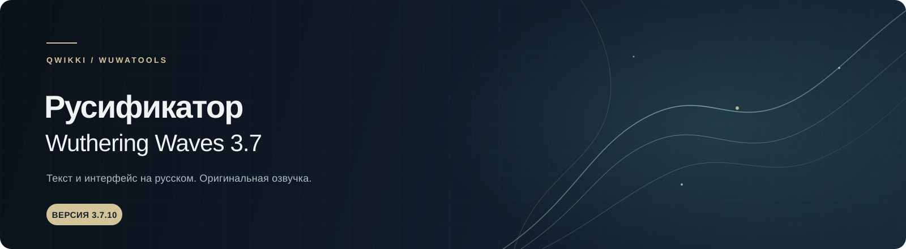

  

   

  
<strong>Русский текст и интерфейс для Wuthering Waves</strong> 
  Оригинальная озвучка остаётся без изменений.

  
<strong>Игра 3.7.10 &nbsp;·&nbsp; Перевод beta3 &nbsp;·&nbsp; Windows и Android</strong>

---

## О проекте

**Русификатор Wuthering Waves 3.7 от Qwikki / WuwaTools** переводит текст и интерфейс игры на русский язык. Озвучка персонажей и музыка остаются оригинальными.

Актуальная сборка подготовлена для версии игры **3.7.10**. Перевод обновляется отдельно от игры, поэтому строки, добавленные разработчиками после выпуска сборки, могут временно отображаться на английском.

## Скачать

| Платформа | Файл и установка |
|:--|:--|
| **Windows** | Скачайте актуальную версию с [wuwahub.ru](https://wuwahub.ru/). Wuthering Hub установит перевод и проверит файлы перед запуском игры. |
| **Android** | [Скачать сборку для телефона с Яндекс Диска](https://disk.yandex.ru/d/OctfIW0BgCWg0g). Инструкция по установке приведена ниже. |

## Что входит в сборку

- **Текстовый PAK-файл** — переведённые строки и элементы интерфейса.
- **PAK-файл шрифта** — поддержка кириллицы в игре.
- **Файлы загрузчика для Windows** — подключают файлы перевода при запуске.

Текст и шрифт идут отдельными файлами: для полного отображения перевода необходимы оба. Не переименовывайте файлы сборки и не смешивайте их с файлами старых версий.

## Установка на Windows

### Через Wuthering Hub

Это рекомендуемый способ: лаунчер устанавливает нужные файлы и проверяет, что они находятся в папках игры.

1. Закройте Wuthering Waves.
2. Установите или откройте Wuthering Hub и скачайте перевод.
3. Если лаунчер попросит указать игру, выберите папку установки, внутри которой находится папка <code>Client</code>. В Steam это обычно папка библиотеки <code>steamapps\common\Wuthering Waves</code>.
4. Дождитесь завершения установки и проверки файлов.
5. Запустите игру кнопкой <strong>«Играть»</strong> в Wuthering Hub.

Если Hub не находит игру автоматически, проверьте выбранную папку: в ней должны находиться <code>Client</code> и <code>Engine</code>. Не выбирайте сам файл <code>Client-Win64-Shipping.exe</code>, а также вложенные папки <code>Client</code> или <code>Binaries</code>.

### Ручная установка

Ручной способ нужен только если вы устанавливаете файлы самостоятельно. Перед копированием полностью закройте игру и лаунчер.

1. Найдите папку игры, в которой находится <code>Client</code>.
2. Поместите <code>winmm.dll</code> и <code>wuwaVietHoa.dll</code> в папку <code>Client\Binaries\Win64\</code>. Они должны лежать рядом с <code>Client-Win64-Shipping.exe</code>.
3. Поместите оба PAK-файла перевода в папку <code>Client\Content\Paks\~mods\</code>.
4. Если папки <code>~mods</code> нет, создайте её именно с таким именем.
5. Удалите или переместите из <code>~mods</code> файлы других русификаторов: несколько переводов могут подменять одни и те же строки.
6. Запустите игру через Wuthering Hub и проверьте перевод.

## Установка на Android

Для Android используется отдельная сборка. Не копируйте в телефон Windows-файлы PAK или DLL.

1. Запустите Wuthering Waves хотя бы один раз, затем полностью закройте игру.
2. Скачайте Android-сборку по ссылке выше и распакуйте архив, если он скачался в ZIP.
3. Скопируйте оба PAK-файла из сборки — перевод и шрифт — в папку игры. Сначала проверьте основной путь:

   <pre><code>Android/data/com.kurogame.wutheringwaves.global/files/UE4Game/Client/Client/Saved/Paks/</code></pre>

4. Если папки <code>Paks</code> по этому адресу нет, проверьте альтернативный путь:

   <pre><code>Android/data/com.kurogame.wutheringwaves.global/files/UE4Game/Client/Client/Saved/Resources/Video/Paks/</code></pre>

5. Если целевой папки нет, создайте её. Не заменяйте и не удаляйте штатные файлы игры.
6. Полностью закройте игру и запустите её заново.

На Android 11 и новее папка <code>Android/data</code> может быть скрыта или недоступна в обычном файловом менеджере. В таком случае передайте файлы через USB с компьютера или используйте файловый менеджер, который умеет работать с этой папкой.

## Настройки языка

Для работы русификатора установите **English** как язык текста в настройках игры. Русификатор заменяет текстовые ресурсы английского языка; отдельная настройка русской озвучки не нужна.

## Если перевод не появился

- **Проверьте язык текста.** В игре должен быть выбран English.
- **Перезапустите игру полностью.** Закрытия до меню может быть недостаточно — завершите процесс игры и запустите снова.
- **Проверьте комплектность.** Для Windows должны быть установлены DLL загрузчика, PAK перевода и PAK шрифта; для Android — оба PAK-файла.
- **Проверьте папки установки.** Windows PAK-файлы находятся в <code>Client\Content\Paks\~mods\</code>, а DLL — рядом с <code>Client-Win64-Shipping.exe</code> в <code>Client\Binaries\Win64\</code>.
- **Уберите старые переводы.** В папке <code>~mods</code> не должно быть других русификаторов или резервных копий PAK-файлов.
- **Обновите сборку после обновления игры.** После патча Wuthering Waves перевод может потребовать обновления.
- **Не переименовывайте файлы.** Сохраните имена и окончания файлов из скачанного комплекта.

Сообщение <code>Hooked successfully</code> означает, что DLL загрузчика подключилась. Само по себе оно не подтверждает, что нужные PAK-файлы найдены и применены.

Если проблема осталась, напишите в [Telegram Wuwa News](https://t.me/WuwaNewss). Укажите платформу, версию игры, способ установки и приложите снимок экрана или текст ошибки. Не публикуйте пароли, токены и другие данные аккаунта.

## Скриншот

  

## Авторы и ссылки

- **Автор русификатора:** Qwikki / WuwaTools
- **Партнёр:** [wuwa.mvdev.space](https://wuwa.mvdev.space/)
- **Поддержка и обсуждение:** [Telegram Wuwa News](https://t.me/WuwaNewss)
- **Основа загрузчика:** [wuwa-viet-hoa](https://github.com/Lai-Hoang/wuwa-viet-hoa) от Lai-Hoang, лицензия MIT

---

Это неофициальный фанатский проект, не связанный с Kuro Games. Права на Wuthering Waves и игровые материалы принадлежат их правообладателям.
